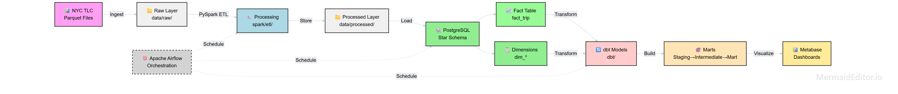

# NYC Taxi Data Engineering Pipeline

End-to-end batch ETL pipeline for NYC TLC Yellow Taxi trip data —
raw Parquet → Spark processing → PostgreSQL star schema → dbt transformations → Power BI.




---

## Overview

Processes NYC TLC Yellow Taxi trip records through a multi-stage batch pipeline:
ingestion from public Parquet files → Spark-based ETL → PostgreSQL star schema warehouse
→ dbt transformation layers → Power BI analytics.

## Key Highlights

- Processes **~3M+ trip records** across 12 months (2024 NYC TLC dataset)
- Spark ETL with schema validation, null/outlier handling, and data quality reporting
- Star schema: `fact_trip` + 5 dimension tables optimized for analytical queries
- dbt models across 3 layers: staging → intermediate → marts
- Fully containerized PostgreSQL via Docker Compose

---

## Architecture

```
[NYC TLC – Public HTTP]
        │  Parquet files (~900 MB raw, ~1.5 GB including processed data)
        ▼
[Apache Spark 3.5.1]  extract → validate → transform → load
        │  Processed Parquet  →  data/processed/
        ▼
[PostgreSQL 16]  Star Schema  (fact_trip + 5 dimension tables)
        │
        ▼
[dbt 1.8]  staging → intermediate → marts
        │
        ▼
[Power BI]  Interactive dashboards
```

---

## Tech Stack

| Technology | Version | Purpose |
| :--- | :---: | :--- |
| Python | `3.12` | Core ETL language |
| Apache Spark | `3.5.1` | Distributed data processing |
| PostgreSQL | `16` | Star schema data warehouse |
| dbt-postgres | `1.8.0` | SQL transformation layer |
| Docker Compose | `26.x` | PostgreSQL containerization |
| Power BI Desktop | `2.x` | Business analytics & reporting |
| JDBC (PostgreSQL) | `42.x` | Spark → PostgreSQL connectivity |

---

## Project Structure

```
NYC_Taxi_Project/
├── spark/
│   ├── config.py
│   ├── etl/
│   │   ├── extract.py
│   │   ├── transform.py
│   │   ├── validate.py
│   │   ├── load.py
│   │   ├── load_warehouse.py
│   │   ├── fetch_taxi_data.py
│   │   ├── pipeline.py
│   │   ├── main.py
│   │   └── run_pipeline.py
│   └── utils/
│       ├── logger.py
│       └── spark_session.py
├── dbt/
│   ├── dbt_project.yml
│   ├── profiles.yml
│   ├── models/
│   │   ├── staging/
│   │   ├── intermediate/
│   │   └── marts/
│   ├── tests/
│   └── macros/
├── infrastructure/
│   ├── docker/
│   ├── hadoop/
│   └── warehouse/
├── data/
│   ├── raw/yellow/
│   └── processed/
├── docs/
│   ├── architecture.md
│   ├── data_model.md
│   ├── data_dictionary.md
│   ├── dbt_learning_guide.md
│   └── IMPLEMENT_PLAN.md
├── tests/
├── logs/
├── pyproject.toml
├── .env.example
├── .gitignore
└── README.md
```

---

## ETL Pipeline

```
1. EXTRACT  (PySpark)
   -- Download Yellow Taxi Parquet from NYC TLC
   -- Store in data/raw/yellow/

2. TRANSFORM  (PySpark)
   -- Clean data, remove outliers
   -- Add derived columns: trip_duration_min | tip_ratio | pickup_date
   -- Validate schema consistency

3. VALIDATE  (PySpark)
   -- Data quality checks (nulls, ranges, referential integrity)
   -- Generate quality reports

4. LOAD  (PySpark + JDBC)
   -- Write partitioned Parquet to data/processed/
   -- Load into PostgreSQL star schema tables

5. TRANSFORM  (dbt)
   -- staging      : Standardize & document sources
   -- intermediate : Business logic, enriched views
   -- marts        : Analytics-ready fact/dim tables

6. VISUALIZE  (Power BI)
   -- Connect to PostgreSQL mart tables
   -- Interactive dashboards & reports
```

---

## Data Model — Star Schema

| Table | Type | Description |
| :--- | :---: | :--- |
| `fact_trip` | Fact | Trip records with measures (fare, distance, duration) |
| `dim_vendor` | Dimension | Taxi vendor information |
| `dim_payment` | Dimension | Payment type lookup |
| `dim_rate` | Dimension | Rate code lookup |
| `dim_location` | Dimension | Pickup / dropoff zone mapping |
| `dim_time` | Dimension | Time dimension for temporal analysis |

---

## Quick Start

### Prerequisites

| Requirement | Version | Notes |
| :--- | :---: | :--- |
| Python | `3.12+` | |
| Java (Eclipse Adoptium) | `21` | Required for Apache Spark |
| Docker & Docker Compose | `26+` | For PostgreSQL container |
| Git | `2.36+` | |
| Free disk space | `~2 GB` | Raw + processed data |

> **Windows users:** Set `HADOOP_HOME` and add `winutils.exe` to `%HADOOP_HOME%\bin` before running Spark locally.

### 1. Clone & Setup

```bash
git clone https://github.com/lancelotviendangkhoa710/nyc-taxi-de-project.git
cd nyc-taxi-de-project

python -m venv .venv
.venv\Scripts\activate        # Windows
source .venv/bin/activate     # macOS/Linux

pip install -e .
pip install dbt-postgres
```

### 2. Configure Environment

```bash
cp .env.example .env
# Edit .env:
# PG_HOST=localhost
# PG_PORT=5432
# PG_USER=postgres
# PG_PASSWORD=postgres
# PG_DATABASE=postgres
```

### 3. Start PostgreSQL

```bash
cd infrastructure/docker
docker compose up -d
docker compose logs postgres
```

### 4. Run Spark ETL

```bash
python -m spark.etl.main

# Or individual stages:
python -m spark.etl.extract
python -m spark.etl.transform
python -m spark.etl.validate
python -m spark.etl.load_warehouse
```

### 5. Run dbt

```bash
cd dbt
dbt debug
dbt run
dbt test
dbt docs generate
dbt docs serve
```

### 6. Verify Data

```bash
psql -h localhost -U postgres -d postgres
\dt public.*
SELECT COUNT(*) FROM fact_trip;
SELECT COUNT(*) FROM dim_vendor;
```

---

## Project Status

| Component | Status |
| :--- | :---: |
| Spark ETL Pipeline | ✅ Completed |
| PostgreSQL Star Schema | ✅ Completed |
| dbt Transformation Layer | ✅ Completed |
| Power BI Dashboards | 🔲 Planned |
| Apache Airflow Orchestration | 🔲 Planned |

---

## References

- [NYC TLC Trip Record Data](https://www.nyc.gov/site/tlc/about/tlc-trip-record-data.page)
- [Apache Spark Documentation](https://spark.apache.org/docs/latest/)
- [dbt Documentation](https://docs.getdbt.com/)
- [PostgreSQL 16 Documentation](https://www.postgresql.org/docs/16/)
