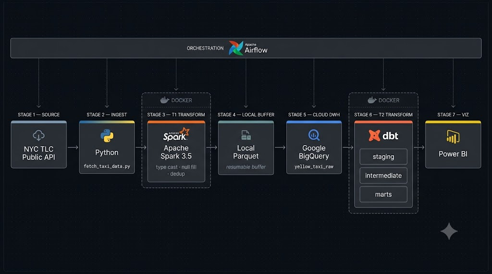

# NYC Taxi Data Engineering Pipeline

An end-to-end batch ETLT pipeline for NYC TLC Yellow Taxi trip data, transforming raw Parquet files into a BigQuery star schema ready for BI analytics.


---

## 📌 Project Overview

Processes 16 months (2025-05 to present) of NYC TLC Yellow Taxi trip records through a multi-stage ETLT batch pipeline. The pipeline is designed around idempotency, ensuring reliable reruns without data duplication.

**ETLT Architecture:**
- **T1 (Spark)** — File-level operations: schema enforcement, type casting, null filling, and deduplication. No business logic.
- **T2 (dbt in BigQuery)** — Warehouse-level operations: outlier filtering, business metric derivation (`trip_duration_min`, `tip_ratio`), and building the final dimensional star schema.

---

## 🎯 Key Achievements

- **Automated CI/CD Deployment:** Implemented automated deployment to a single-node AWS EC2 via GitHub Actions, eliminating manual SSH tasks while keeping infrastructure costs minimal.
- **Idempotent Data Processing:** Developed a custom JSON metadata tracker to manage file states (`fetched`, `processed`, `bq_loaded`, `dbt_tested`), allowing safe pipeline recovery and resumability.
- **Infrastructure Mastery:** Deployed the complete stack on AWS EC2 (Amazon Linux 2023), configuring Docker daemon permissions (using `setfacl` for Airflow socket access) and managing secure SSH access with Elastic IPs.
- **Data Quality Enforcement:** Integrated `dbt test` to proactively catch data anomalies (e.g., negative fare amounts) and implemented SQL-level outlier filtering to prevent pipeline failures from anomalous records.
- **Clear Separation of Concerns:** Kept Spark focused on heavy lifting (data cleaning) and let dbt handle SQL-based business logic, making the pipeline highly maintainable.

---

## 🏗️ Architecture



```
[NYC TLC - Public HTTP]
        |
[fetch_taxi_data.py]  ->  data/raw/yellow/
        |
[Apache Spark 3.5.0 -- T1 Transform]
  standardize_data_types() | handle_null_values() | remove_duplicates()
        |
[BigQuery -- nyc_taxi_raw.yellow_taxi_raw]
        |
[dbt -- T2 Transform]
  staging -> intermediate -> marts
        |
[Power BI Dashboard]
```

---

## ⚙️ Tech Stack

| Component | Technology | Purpose |
| :--- | :--- | :--- |
| **Orchestration** | Apache Airflow `2.10.5` | Manage DAGs and scheduling |
| **Compute / T1** | PySpark `3.5.0` | Distributed data cleaning |
| **Storage (Cloud)** | Google BigQuery | Cloud Data Warehouse |
| **Transformation / T2** | dbt `1.8.x` | SQL transformation layer |
| **Infrastructure** | AWS EC2 (Amazon Linux) | Host server (Single-node) |
| **Containerization**| Docker & Docker Compose | Isolate Airflow, Spark, and dbt environments |
| **CI/CD** | GitHub Actions | Automated Linting, dbt parsing, and EC2 deployment |

---

## 📁 Project Structure

```
NYC_Taxi_Project/
+-- spark/
|   +-- config.py                  # Paths, Spark/BQ config, SELECTED_COLUMNS
|   +-- etl/
|       +-- fetch_taxi_data.py     # Download raw Parquet from NYC TLC
|       +-- extract.py             # Spark read + column pruning
|       +-- validate.py            # Schema & empty-frame checks
|       +-- transform.py           # T1: standardize, null-fill, dedup, pickup_date
|       +-- load.py                # coalesce(1) -> local Parquet
|       +-- load_bigquery.py       # Upload Parquet -> BigQuery
|       +-- metadata.py            # Per-file status tracking
|       +-- pipeline.py            # Orchestrates full ETLT flow
|       +-- main.py
+-- dbt/
|   +-- seeds/taxi_zone_lookup.csv
|   +-- models/
|       +-- staging/               # stg_trip, stg_vendor, stg_payment, stg_rate, stg_location, stg_time
|       +-- intermediate/          # int_trips_with_dimensions, int_trip_metrics_*
|       +-- marts/                 # fct_trip_summary, fct_vendor_daily_metrics, mart_revenue_by_zone_hour
+-- infrastructure/docker/         # Dockerfile.spark, Dockerfile.dbt, docker-compose.yml
+-- scripts/
|   +-- clean_bigquery.py          # Drop all BQ tables
|   +-- reset_metadata_status.py   # Reset ETL metadata for re-run
+-- data/
|   +-- raw/yellow/                # Source Parquet files
|   +-- processed/yellow_taxi/     # source_month=YYYY-MM/ (1 file each)
|   +-- metadata/etl_metadata.json # Pipeline state
+-- tests/
+-- docs/
+-- README.md
```

---

## Quick Start

### Prerequisites

- Python 3.12+, Java 21, Docker 26+
- GCP Service Account with BigQuery write permission
- Place `gcp_service_account.json` in project root

### 1. Clone & Setup

```bash
git clone https://github.com/lancelotviendangkhoa710/nyc-taxi-de-project.git
cd nyc-taxi-de-project
python -m venv .venv && .venv\Scripts\activate
pip install -e .
```

### 2. Configure Environment

```bash
cp .env.example .env
# Set GCP_PROJECT_ID, GCP_DATASET_RAW, and GCP_KEYFILE_PATH. Keep .env and the key file local.
```

### 3. Fetch Raw Data

```bash
python -m spark.etl.fetch_taxi_data
```

### 4. Run ETL Pipeline (Docker)

```bash
cd infrastructure/docker
docker compose -f docker-compose.yml build spark-etl

# One batch at a time (picks next unprocessed file)
docker compose -f docker-compose.yml run --rm spark-etl
```

## Roadmap & Scalability Considerations

This architecture is deliberately designed for small-to-medium batch processing (~1GB/year). If data volume scales to **1TB+/day**, the following architectural evolution is required to avoid bottlenecking and over-engineering penalties:

| Component | Current (Portfolio Scale) | Target (1TB+/day Scale) | Reason |
| :--- | :--- | :--- | :--- |
| **Storage** | Local disk (`/data`) on EC2 | Cloud Object Storage (GCS/S3) | Local disk will fill up. Object storage offers infinite scaling and decoupling. |
| **Compute** | Single-node Spark inside Docker | Dataproc / EMR Cluster | Single container RAM/CPU limits will OOM (Out of Memory). Need distributed worker nodes. |
| **Orchestration** | Single EC2 Airflow LocalExecutor | Cloud Composer / MWAA | Local Airflow scheduler cannot handle hundreds of concurrent DAGs. |
| **Data Load** | Pandas/BQ SDK insert | BigQuery Load Jobs from GCS | Direct API inserts at 1TB scale are extremely slow and expensive. Loading from GCS buckets via native BQ mechanisms is heavily optimized. |

<!-- CD Workflow Test Comment -->

---

### 5. Run dbt

```bash
docker compose -f docker-compose.yml run --rm dbt
# or locally:
cd dbt && dbt run && dbt test
```

### 6. Utility Scripts

```bash
# Full BQ reset
python scripts/clean_bigquery.py

# Reset metadata to re-process all files
python scripts/reset_metadata_status.py
```

---

## Performance

| Batch size | Spark T1 | BQ upload | Total/file |
| :--- | :---: | :---: | :---: |
| ~80 MB/month | ~30s | ~10-15s | **~1.5 min** |

Use the reproducible Spark benchmark harness in `spark/benchmark/etl_benchmark.py`. Run every configuration at least three times and report median duration before claiming an improvement. Current local output uses one Parquet file per monthly batch to reduce Python SDK BigQuery load-job overhead; it is deliberately limited to small batches and needs a multi-file/cloud-storage strategy as volume grows.

---

## Project Status

| Component | Status |
| :--- | :---: |
| Data fetch (2025-05 to 2026-05) | Done |
| Spark ETL T1 (clean & standardize) | Done |
| BigQuery staging load | Done |
| dbt T2 staging / intermediate / marts | Done |
| Docker Compose (Spark + dbt) | Done |
| GitHub Actions (Python unit tests + dbt parse) | Done |
| Power BI Dashboards | Inprogress |
| Apache Airflow Orchestration | Done |

---

## References

- [NYC TLC Trip Record Data](https://www.nyc.gov/site/tlc/about/tlc-trip-record-data.page)
- [Apache Spark Documentation](https://spark.apache.org/docs/latest/)
- [dbt Documentation](https://docs.getdbt.com/)
- [Google BigQuery Documentation](https://cloud.google.com/bigquery/docs)
