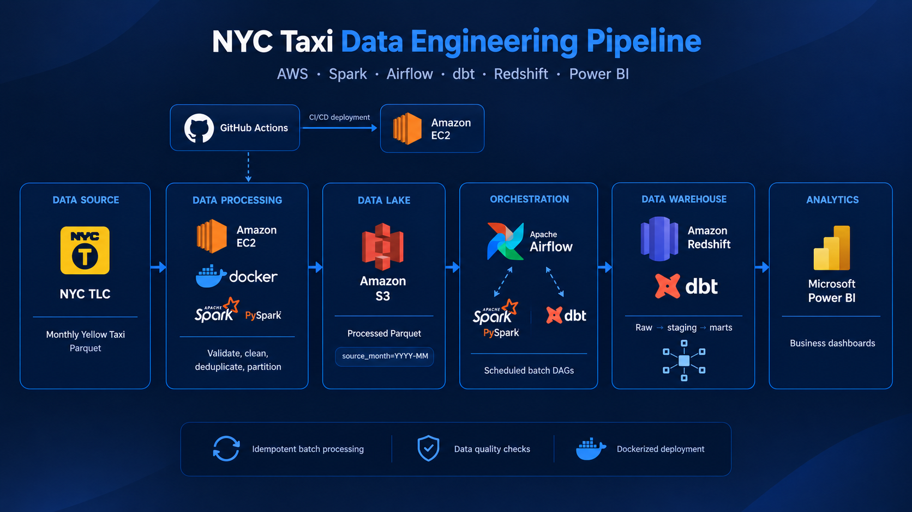
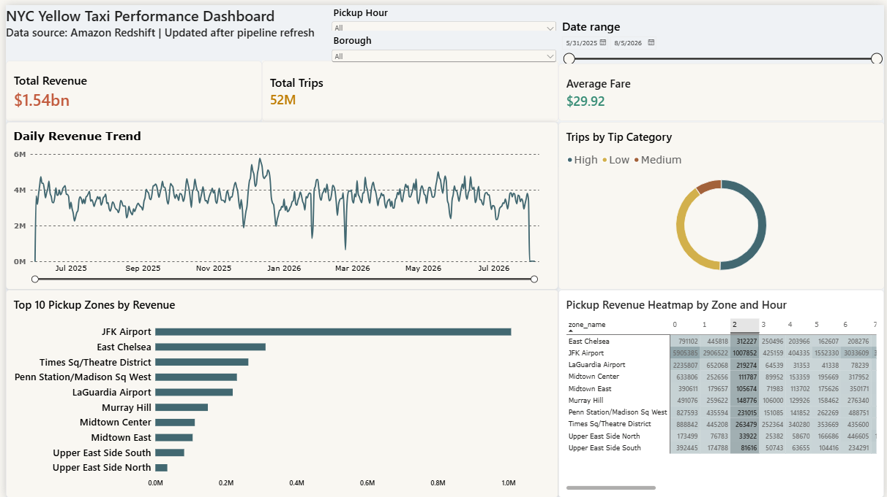
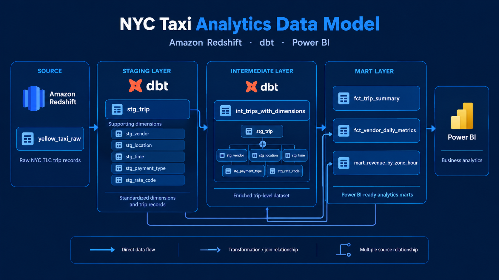
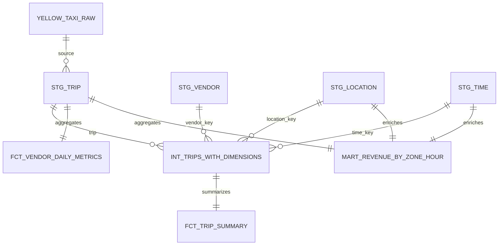
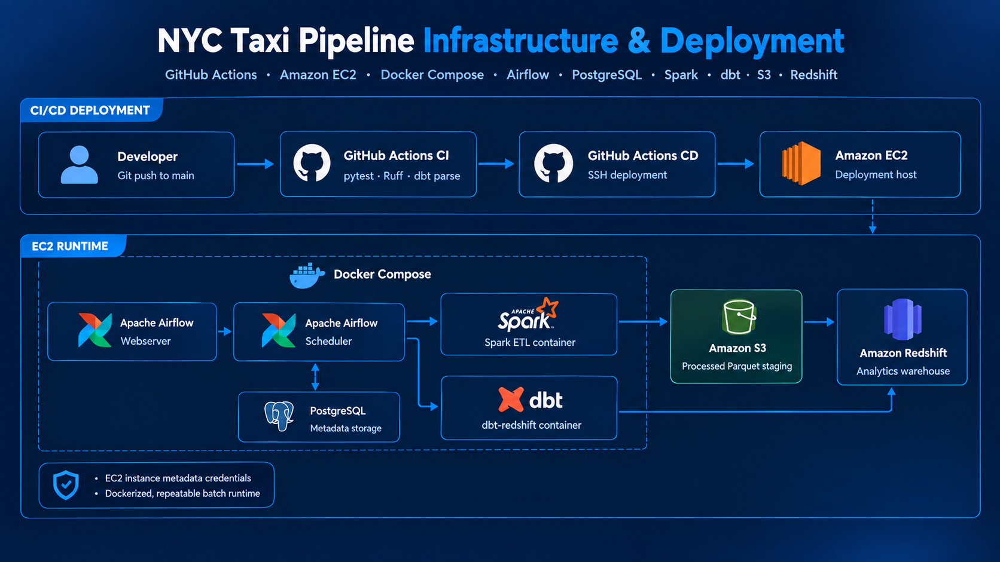
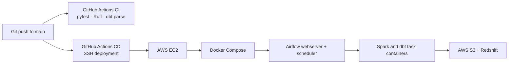

<div align="center">

# NYC Taxi Data Engineering Pipeline

### Idempotent batch ETLT for NYC TLC Yellow Taxi data — Spark cleaning, S3 staging, Redshift warehousing, and dbt analytics marts.

[](pyproject.toml)
[](spark/)
[](spark/etl/load_redshift.py)
[](dbt/profiles.yml)
[](dbt/)
[](airflow/dags/nyc_taxi_etl_pipeline.py)
[](infrastructure/docker/)
[](.github/workflows/ci.yml)

[Architecture](#architecture) · [Dashboard](#power-bi-dashboard) · [Performance](#measured-performance) · [Pipeline](#pipeline-data-flow) · [Data quality](#data-quality) · [Quick start](#quick-start)

</div>

---

## At a glance

This repository ingests monthly **NYC TLC Yellow Taxi** Parquet files, validates and standardizes them with PySpark, stages processed batches in Amazon S3, and loads them into Amazon Redshift. dbt then builds staging, intermediate, and mart-layer models for BI consumption. Apache Airflow coordinates Spark, dbt, tests, and batch finalization in Docker containers.

The pipeline is deliberately batch-oriented. A persistent JSON manifest tracks each source file, while Redshift reloads a source month by deleting that month's raw records before `COPY`.

## What makes this more than a basic ETL job?

| Engineering concern | Implementation in this repository |
| --- | --- |
| Safe reruns | `ETLMetadata` records file states; Redshift deletes an existing `source_month` before `COPY`ing its replacement batch. |
| Separation of transformations | Spark T1 performs file-level validation and normalization; dbt T2 creates keys, metrics, dimensional joins, and marts. |
| Data quality | Spark checks required columns and empty inputs. dbt declares uniqueness, null, accepted-value, range, and expression tests. |
| Warehouse loading | Processed Parquet is uploaded to S3, then loaded into `yellow_taxi_raw` through Redshift `COPY ... FORMAT AS PARQUET`. |
| Orchestration | Airflow runs Spark, `dbt debug`, dependencies, seeds, models, tests, then finalization in order. |
| Repeatable runtime | Dedicated Spark and dbt Docker images; Airflow uses `DockerOperator` to launch pipeline tasks. |
| Delivery checks | GitHub Actions runs Python tests, Ruff checks/format validation, and `dbt parse`; a separate workflow deploys to EC2 over SSH. |

## Architecture



NYC TLC monthly Parquet data is validated and transformed by PySpark in Docker on EC2, staged as partitioned Parquet in S3, loaded into Redshift, modeled by dbt, and consumed in Power BI. Airflow orchestrates the batch workflow; GitHub Actions deploys it to EC2.

<details>
<summary><strong>Technical data flow</strong></summary>


```mermaid
flowchart LR
    TLC[NYC TLC<br/>Yellow Taxi Parquet] --> INGEST[Python ingestion<br/>fetch_taxi_data.py]
    INGEST --> RAW[Local raw staging]
    RAW --> SPARK[PySpark T1<br/>validate · cast · fill nulls · deduplicate]
    SPARK --> PARQUET[Processed Parquet<br/>source_month batch]
    PARQUET --> S3[Amazon S3<br/>silver/yellow_taxi/source_month=YYYY-MM]
    S3 --> COPY[Redshift COPY]
    COPY --> RAW_TABLE[(Redshift<br/>yellow_taxi_raw)]
    RAW_TABLE --> DBT[dbt T2]
    DBT --> STG[staging]
    STG --> INT[intermediate]
    INT --> MARTS[marts]
    MARTS --> BI[Power BI]

    AIRFLOW[Apache Airflow<br/>DockerOperator] -. orchestrates .-> SPARK
    AIRFLOW -. orchestrates .-> DBT
    DOCKER[Docker Compose on EC2] -. runtime .-> AIRFLOW
```

<summary><strong>Orchestrated task sequence</strong></summary>

`validate_runtime_configuration` → `run_spark_etl` → `dbt_debug` → `dbt_deps` → `dbt_seed` → `dbt_run` → `dbt_test` → `finalize_verified_batches`

</details>

## Power BI dashboard



Power BI visualizes the Redshift mart layer, including trip volume, revenue, fares, tips, and location-based performance.

## Measured performance

Spark T1 was benchmarked in the deployed Docker runtime on a 2-vCPU EC2 instance with 7.6 GiB RAM. The benchmark reads one NYC TLC Yellow Taxi monthly Parquet batch, applies type standardization, null handling, whole-row deduplication, and `pickup_date`/`source_month` derivation, then writes partitioned Parquet. It does not upload to S3 or load Redshift.

| Configuration | Input | Rows in / out | Read | Transform | Write | Total | Throughput |
| --- | --- | ---: | ---: | ---: | ---: | ---: | ---: |
| 2 vCPU, 4 partitions | 70.14 MiB, 1 month | 4,322,960 / 4,322,960 | 21.992s | 41.051s | 21.637s | 84.680s | 51,050 rows/s |
| 2 vCPU, 8 partitions | 70.14 MiB, 1 month | 4,322,960 / 4,322,960 | 20.007s | 41.831s | 16.432s | **78.270s** | **55,232 rows/s** |

Increasing write partitions from 4 to 8 reduced end-to-end runtime by **6.410s (7.57%)**, driven by a **5.205s** reduction in Parquet write time. The output grew from 112.86 MiB to 122.30 MiB, an explicit throughput-versus-file-size trade-off. The full, reproducible EC2 result is tracked in [`evidence/spark-benchmark.csv`](evidence/spark-benchmark.csv).

> Benchmark scope: Spark T1 only. Redshift `COPY`, dbt model/test durations, and Power BI query latency require separate warehouse-connected measurements and are not represented by this result.

## SQL patterns and warehouse optimization

The warehouse layer uses dbt SQL for data quality, dimensional enrichment, and BI-oriented aggregation. [`dbt/analyses/analytics_query_patterns.sql`](dbt/analyses/analytics_query_patterns.sql) contains read-only Redshift query examples for the marts.

| Pattern | Implementation | Why it matters |
| --- | --- | --- |
| Cross-batch deduplication | `ROW_NUMBER() OVER (PARTITION BY trip_id)` in [`stg_trip`](dbt/models/staging/stg_trip.sql) retains `duplicate_rank = 1` after generating a SHA-256 trip key. | Removes duplicate logical trips beyond Spark's whole-row deduplication. |
| Top-N within a group | `DENSE_RANK() OVER (PARTITION BY borough ORDER BY total_revenue DESC)` ranks pickup zones inside each borough. | Preserves ties while avoiding application-side ranking. |
| Cumulative metric | `SUM(total_revenue) OVER (PARTITION BY vendor_name ORDER BY trip_date ROWS BETWEEN UNBOUNDED PRECEDING AND CURRENT ROW)` produces vendor running revenue. | Computes time-series analytics in SQL. |
| BI query reduction | `mart_revenue_by_zone_hour` aggregates trips at pickup-zone/hour grain; `fct_vendor_daily_metrics` aggregates at vendor/day grain. | Power BI reads aggregate marts for zone, hour, and daily trends instead of repeatedly aggregating trip-grain data. |
| Incremental rebuild | dbt uses `delete+insert` plus a `source_month` pre-hook. | Rebuilds the latest batch idempotently while avoiding a full historical rebuild during normal runs. |

The query examples are intentionally separate from dbt models: they are read-only analysis patterns, not production relations. Run the read-only fact-versus-mart benchmark in the deployed Spark image to generate sanitized Redshift timing evidence:

```bash
docker compose -f infrastructure/docker/docker-compose.yml run --rm \
  --entrypoint python spark-etl \
  -m spark.benchmark.redshift_query_benchmark \
  --output /app/data/evidence/redshift-query-benchmark.json
```

The command reads warehouse aggregates only; it performs no inserts, deletes, or DDL. Copy the JSON into `evidence/` only after reviewing it for public-safe metadata.

## Pipeline data flow

| Stage | Component | Responsibility |
| --- | --- | --- |
| **1. Ingestion** | `spark/etl/fetch_taxi_data.py` | Downloads monthly `yellow_tripdata_YYYY-MM.parquet` files from the NYC TLC distribution endpoint into local raw staging. |
| **2. T1 validation & transformation** | PySpark | Verifies required columns and non-empty input; casts selected types, fills configured null defaults, removes duplicates, and adds `pickup_date`. |
| **3. Batch persistence** | Local Parquet + metadata | Writes processed Parquet by `source_month`; maintains a JSON manifest for fetched, processed, loaded, tested, completed, and failed states. |
| **4. Warehouse loading** | S3 + Redshift | Uploads processed Parquet to partitioned `silver/` S3 storage; replaces the raw data for that source month before Redshift `COPY`. |
| **5. T2 transformation** | dbt-redshift | Builds staging models, dimensional joins and aggregate intermediates, then analytical marts in Redshift. |
| **6. Analytics** | Power BI | Published dashboard consuming Redshift mart-layer aggregates. |

## Engineering decisions

- **Spark for T1:** File-level validation, casting, null defaults, and deduplication run before warehouse loading. Spark also writes Parquet with timestamp types compatible with Redshift `COPY`.
- **S3 + Redshift:** S3 is the staging/backup boundary. Redshift loads the Parquet batches with `COPY`, avoiding row-by-row application inserts.
- **Source-month replacement:** Every loaded batch carries `source_month`; the loader deletes that month from `yellow_taxi_raw` before reloading it. This is the warehouse-level idempotency boundary.
- **dbt for T2:** SQL models isolate warehouse transformation from file processing. Trip-grain and daily-vendor fact models use incremental `delete+insert`; each normal run deletes and rebuilds the latest `source_month`, while historical backfills use `--full-refresh`.
- **Airflow + Docker:** Airflow defines dependencies and launches isolated Spark/dbt task containers. Docker provides the same containerized runtime for local orchestration and the EC2 deployment target.
- **GitHub Actions:** CI validates Python code and dbt project parsing. CD rebuilds Docker images and restarts Airflow services on EC2 after deployment.

## Data model

The dbt project materializes a cleaned trip model, dimensions for vendor/location/time/payment/rate, enrichment/aggregation models, and three current marts: `fct_trip_summary`, `fct_vendor_daily_metrics`, and `mart_revenue_by_zone_hour`.



<details>
<summary><strong>Technical model relationships</strong></summary>


```mermaid
erDiagram
    YELLOW_TAXI_RAW ||--o{ STG_TRIP : source
    STG_VENDOR ||--o{ INT_TRIPS_WITH_DIMENSIONS : vendor_key
    STG_LOCATION ||--o{ INT_TRIPS_WITH_DIMENSIONS : location_key
    STG_TIME ||--o{ INT_TRIPS_WITH_DIMENSIONS : time_key
    STG_TRIP ||--o{ INT_TRIPS_WITH_DIMENSIONS : trip
    INT_TRIPS_WITH_DIMENSIONS ||--|| FCT_TRIP_SUMMARY : summarizes
    STG_TRIP ||--|| FCT_VENDOR_DAILY_METRICS : aggregates
    STG_TRIP ||--|| MART_REVENUE_BY_ZONE_HOUR : aggregates
    STG_LOCATION ||--|| MART_REVENUE_BY_ZONE_HOUR : enriches
    STG_TIME ||--|| MART_REVENUE_BY_ZONE_HOUR : enriches
```

</details>

## Data quality

**Before load — Spark**

- Required-column validation and empty-dataframe rejection.
- Explicit casts for timestamps, numeric measures, and key fields.
- Default values for configured nullable fields.
- Whole-row deduplication.

**In the warehouse — dbt**

- Source freshness thresholds on `yellow_taxi_raw`, using `pickup_date`.
- `unique` and `not_null` tests on trip and dimension keys.
- Accepted-value checks for vendor keys.
- Range/expression checks for fares, distance, trip duration, pickup dates, totals, and time-of-day values.
- `stg_trip` derives a SHA-256 trip key, retains one row per key, and filters invalid tip ratios.

## Infrastructure & deployment



<details>
<summary><strong>Technical deployment flow</strong></summary>


```mermaid
flowchart LR
    DEV[Git push to main] --> CI[GitHub Actions CI<br/>pytest · Ruff · dbt parse]
    DEV --> CD[GitHub Actions CD<br/>SSH deployment]
    CD --> EC2[AWS EC2]
    EC2 --> COMPOSE[Docker Compose]
    COMPOSE --> AF[Airflow webserver + scheduler]
    AF --> TASKS[Spark and dbt task containers]
    TASKS --> AWS[AWS S3 + Redshift]
```

</details>

The Airflow compose configuration uses `LocalExecutor` with PostgreSQL metadata storage. Optional SMTP environment variables enable task-failure email alerts. On EC2, AWS credentials can be supplied through the instance metadata service instead of static keys.

## Tech stack

| Area | Technology | Role |
| --- | --- | --- |
| Language | Python 3.12 | Ingestion, Spark ETL, utilities |
| Orchestration | Apache Airflow 2.10.5 | DAG scheduling and task dependency management |
| Compute | PySpark 3.5.0 | T1 validation and file-level transformations |
| Storage | Amazon S3 | Processed-Parquet staging and backup |
| Warehouse | Amazon Redshift | Raw table and dbt model storage |
| Transformation | dbt-redshift | T2 SQL models, tests, seeds |
| Infrastructure | Docker Compose, AWS EC2 | Container runtime and deployment host |
| CI/CD | GitHub Actions | Tests, linting, dbt parsing, EC2 deployment |
| BI | Power BI | Published dashboard over Redshift mart-layer aggregates |

## Quick start

### Prerequisites

- Python 3.12, Docker Desktop/Engine, and Docker Compose.
- An AWS S3 bucket, Amazon Redshift connection, and a Redshift IAM role permitted to read the bucket.
- AWS credentials for local execution. On EC2, leave both static AWS key variables unset to use instance metadata credentials.

### 1. Local Python setup

```powershell
git clone https://github.com/lancelotviendangkhoa710/nyc-taxi-de-project.git
cd nyc-taxi-de-project
python -m venv .venv
.\.venv\Scripts\Activate.ps1
pip install -e ".[dev]"
```

### 2. Environment configuration

```powershell
Copy-Item .env.example .env
```

Set `AWS_REGION`, `S3_BUCKET`, `REDSHIFT_HOST`, `REDSHIFT_PORT`, `REDSHIFT_DB`, `REDSHIFT_USER`, `REDSHIFT_PASSWORD`, `REDSHIFT_IAM_ROLE`, and `NYC_TAXI_PROJECT_ROOT` in `.env`. Do not commit `.env` or credentials.

### 3. Fetch source data

```powershell
python -m spark.etl.fetch_taxi_data
```

### 4. Build images and start Airflow

```powershell
docker compose -f infrastructure/docker/docker-compose.yml build
docker compose -f infrastructure/docker/docker-compose.airflow.yml up airflow-init
docker compose -f infrastructure/docker/docker-compose.airflow.yml up -d
```

Open `http://localhost:8080`, enable `nyc_taxi_etl_pipeline`, then trigger it from the Airflow UI. The DAG validates the runtime, executes Spark, runs dbt, runs dbt tests, and finalizes verified batches.

### 5. Run dbt directly (optional)

```powershell
cd dbt
dbt deps
dbt debug
dbt seed
dbt run
dbt test
```

## Project status

| Component | State |
| --- | --- |
| NYC TLC ingestion | Complete |
| Spark T1 validation and normalization | Complete |
| S3 staging and Redshift `COPY` loading | Complete |
| dbt staging / intermediate / mart layers | Implemented |
| Airflow orchestration | Implemented |
| Dockerized Spark, dbt, and Airflow runtime | Implemented |
| GitHub Actions CI/CD workflows | Implemented |
| Power BI dashboard | Published to Power BI Service |

## Future improvements

- Add a Redshift/S3 architecture visual and KPI definitions.
- Extend automated integration testing against an AWS test environment.

## References

- [NYC TLC Trip Record Data](https://www.nyc.gov/site/tlc/about/tlc-trip-record-data.page)
- [Apache Spark documentation](https://spark.apache.org/docs/latest/)
- [dbt documentation](https://docs.getdbt.com/)
- [Amazon Redshift COPY documentation](https://docs.aws.amazon.com/redshift/latest/dg/r_COPY.html)